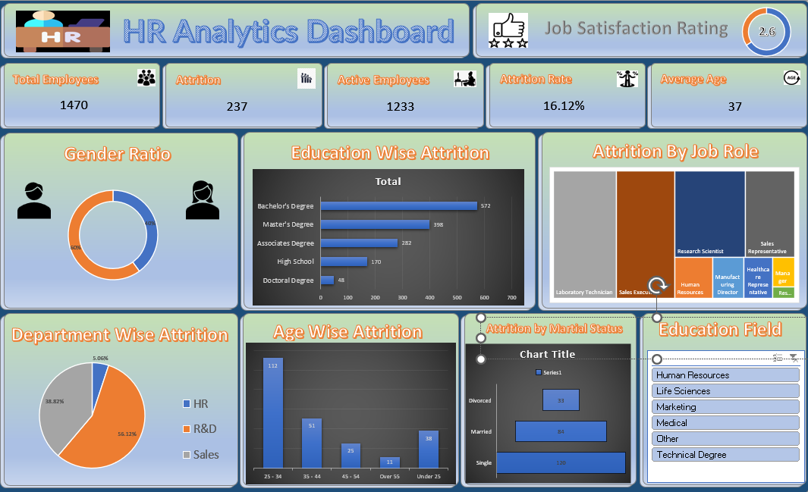

📊 HR Analytics Dashboard (Excel)
📌 Overview

This project presents an HR Analytics Dashboard designed to monitor and analyze employee attrition patterns, workforce demographics, and job satisfaction.

Built entirely in Microsoft Excel, the dashboard enables HR professionals and analysts to quickly identify trends and make data-driven decisions.

🎯 Objectives

Understand employee attrition patterns

Identify high-risk groups for turnover

Analyze workforce demographics (age, gender, education)

Evaluate job satisfaction levels

Support strategic HR decision-making

🛠️ Tools & Technologies Used
📊 Excel Features

Pivot Tables

Pivot Charts

Slicers & Filters

Conditional Formatting

Data Cleaning & Transformation

Dashboard Design (Shapes, Icons, Layouts)

📈 Dashboard Components

KPI Cards (Total Employees, Attrition, Attrition Rate, Average Age)

Donut Chart (Gender Ratio)

Bar Charts (Education-wise & Age-wise Attrition)

Pie Chart (Department-wise Attrition)

Tree Map (Attrition by Job Role)

Interactive Filters (Education Field)

📷 Dashboard Preview

(Add your screenshot here in GitHub repo)

📊 Key Metrics

Total Employees: 1470

Attrition Count: 237

Attrition Rate: 16.12%

Active Employees: 1233

Average Age: 37

Job Satisfaction Rating: 2.6 / 5

🔍 Key Insights
1. Attrition Trends

Attrition rate of 16.12% indicates moderate employee turnover.

Majority of attrition comes from specific roles like:

Laboratory Technicians

Sales Executives

Research Scientists

2. Department Analysis

R&D department has the highest attrition (~56%)

Sales and HR follow with lower but notable levels

3. Education Impact

Employees with Bachelor’s degrees show the highest attrition

Doctoral degree holders have the lowest attrition

4. Age Group Insights

Highest attrition occurs in the 25–34 age group

Younger employees (<25) also show notable turnover

5. Gender Distribution

Workforce is relatively balanced, but attrition patterns may vary across genders

6. Job Satisfaction

Average rating of 2.6/5 suggests low employee satisfaction, a key driver of attrition

7. Marital Status

Single employees show the highest attrition rates compared to married/divorced groups

💡 Business Recommendations
🔹 Improve Employee Engagement

Address low job satisfaction through:

Regular feedback systems

Recognition programs

Career growth opportunities

🔹 Focus on High-Risk Groups

Target retention strategies for:

Employees aged 25–34

Sales and lab-related roles

🔹 Enhance Work Culture

Improve work-life balance policies

Strengthen team collaboration and management practices

🔹 Learning & Development

Provide upskilling programs, especially for Bachelor-level employees

Create clear career progression paths

🔹 Compensation & Benefits Review

Benchmark salaries for high-attrition roles

Introduce performance-based incentives

🔹 HR Strategy Optimization

Use predictive analytics for early attrition detection

Implement employee satisfaction surveys regularly

🚀 How to Use

Open the Excel file

Use slicers to filter by education field

Interact with charts for deeper insights

Monitor KPIs for quick overview

📌 Future Improvements

Add predictive attrition modeling

Integrate Power BI for advanced visualization

Automate data updates

Include employee performance metrics

🤝 Contributing

Feel free to fork this repository and improve the dashboard or add new features.

